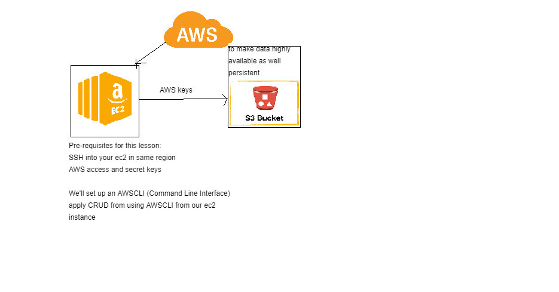

# Disaster Recovery Planning using AWS S3

### Create the ec2 instance(ubuntu 16.04) and ssh into the instance
### Inside the ec2 instance, run the following command to install python v3.7 and awscli
```python
sudo apt-get update -y
sudo apt-get upgrade -y
sudo apt-get install python3-pip
​alias python=python3
​sudo pip3 install awscli
sudo aws configure
```
### Enter the details as they prompt as below:
```
Access Key ID [None]: <enter the access key ID>
Secret Access Key [None]: <enter secret access key>
Default region name [None]: eu-west-1
Access policy type [None]: json
```
### Check if the s3 buckets and create a new s3 bucket
```
aws s3 ls  #we can see s3 buckets if already created
aws s3 mb s3://eng89prathima # make_bucket eng89prathima (special character not allowed)
aws s3 ls #now we can find the newly created bucket here
```
### CRUD operations in s3 using AWSCLI
```
#to create a file inside the instance
nano test.txt   # 'This is a file in ec2 instance' write something into it
#to copy/transfer the from ec2 instance into s3 bucket
aws s3 cp test.txt s3://eng89prathima/  #we can confirm s3 object in the browser
#to delete the file from ec2 instance
rm test.txt
#to download/copy from s3 bucket to ec2 instance
aws s3 cp se://eng89prathima/test.txt test1.txt  #file copied/downloaded from s3 bucket to ec2 instance
#to delete a file from s3 bucket
aws s3 rm s3://eng89prathima/test.txt
#to remove/delete a s3 bucket
aws s3 rb s3://eng89prathima #rb for remove bucket
```